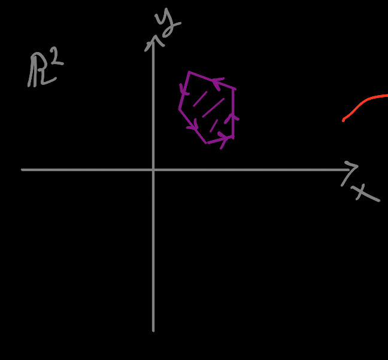

# Determinants

## tl;dr

-   Everything needs to be handwavy and notional for now. It will become more
    clear and precise later.  The process of learning math consists basically
    of first getting enough rough context that you have a vague idea of what
    things are, how they work, what things are true, etc, *then* going back and
    writing down precise definitions and phrasing your knowledge rigorously.
-   Let's suppose we have some polygon in the plane:

    

    We consider the edges of the polygon to have an orientation. This is
    crucial.  For now just vaguely note that the polygon has a
    ``counterclockwise'' orientation.

-   Suppose we have a **linear transformation** (what this means exactly will
    have to wait) $T$ which transforms our purple polygon into this blue
    polygon:

    

    Note that

    1. the blue polygon is like the purple polygon but has a slight horizontal
       distortion
    2. the purple polygon has a "counterclockwise" (**positive**)
       orientation, and the blue polygon has a "clockwise" (**negative**)
       orientation.

    (Terminology: the blue polygon is called **image** of the purple polygon,
    and the purple polygon is called the **preimage** of the blue polygon).

    (Also note that the image I drew above probably isn't actually a linear
    transformation... just bear with me).

-   The **determinant** of $T$ is the factor by which the area of the polygon
    is scaled. If the transformation preserves orientations, the determinant is
    positive. If the transformation inverts orientations, the determinant is
    negative.

-   In this case, the determinant might be something like $-1.5$.  The
    transformation slightly upscales the area but inverts the orientation.

## Introduction

Let me first say that the determinant is an insane place to begin a linear
algebra course.

This choice makes perfect sense from a theoretical point of view: everything
about the essence of linear algebra is contained in the behavior of the
determinant.  Moreover, given linear algebra's centrality in mathematics as a
whole, you could fairly say that everything about the essence of
mathematics as a whole is contained in the determinant.

However, this is a **retrospective** view.  Mathematics is an ancient subject,
dating conservatively to ancient Babylonia.  Linear algebra as a distinct
subject really only emerged in the 20th century.  It's a bit like starting a
course on construction by studying the floor plan of the Sumela Monastery:

