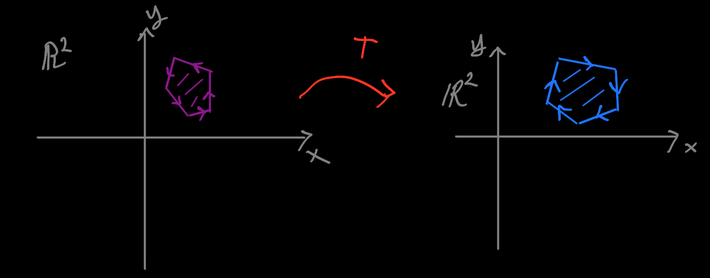

# Linear Algebra 1: Vector Spaces and Linear Transformations

Linear algebra is the study of linear transformations on finite-dimensional
vector spaces.

In math, the two primary categories of objects we study are **sets** and
**functions**.

Vector spaces are a special subcategory of sets, and linear transformations are
a special subcategory of functions.

Most branches of math are the study of some category of sets that have some
structure we're interested in studying, and a complementary category of
functions that play nice with the structure in question.

In order to define vector spaces and linear transformations in a way where the
terms make sense, you need some intuition about what sets and functions are,
and some basic properties and terminology.

A **set** is a special type of collection. If some object $x$ is in the set
$X$, we say "$x$ is an element of $X$", and denote this with \[ x \in X \]. If
$x$ is not an element of $X$, we write \[ x \notin X \].

There is no further structure to a set as-such. A set only "knows" whether or
not it contains some element. Specifically, sets do not have notions of
multiplicity or order. So, all of the following are equal sets:

\[ \{ 1,2,3,4 \} \]
\[ \{ 4,2,1,3 \} \]
\[ \{ 4,2,1,3,4,1 \} \]
\[ \{ 4,2,1,3,4,1,3,2 \} \]

Sets are used as a basic abstraction in math because primitive operations in
logic play nice with the natural operations on sets.

The primitive operations in logic are:

1. `inclusive-or`
2. `and`
3. `not`

We can write these as Erlang functions:

```
ior(false, false) -> false;
ior(false, true)  -> true;
ior(true,  false) -> true;
ior(true,  true)  -> true.

and(false, false) -> false;
and(false, true)  -> false;
and(true,  false) -> false;
and(true,  true)  -> true.

not(false) -> true;
not(true)  -> false.
```


-   Linear algebra is the study of linear transformations on finite-dimensional
    vector spaces.

-   Generally, functions

-   A special property of linear trans

-   Let's suppose we have some polygon in the plane


-   Suppose we have a **linear transformation** (what this means exactly will
    have to wait) $T$ which transforms our purple polygon into this blue
    polygon:

    

    Note that

    1. the blue polygon is like the purple polygon but has a slight horizontal
       distortion
    2. the purple polygon has a "counterclockwise" (**positive**)
       orientation, and the blue polygon has a "clockwise" (**negative**)
       orientation.

    (Terminology: the blue polygon is called **image** of the purple polygon,
    and the purple polygon is called the **preimage** of the blue polygon).

    (Also note that the image I drew above probably isn't actually a linear
    transformation... just bear with me).

-   The **determinant** of $T$ is the factor by which the area of the polygon
    is scaled. If the transformation preserves orientations, the determinant is
    positive. If the transformation inverts orientations, the determinant is
    negative.

-   In this case, the determinant might be something like $-1.5$.  The
    transformation slightly upscales the area but inverts the orientation.

## Introduction

Let me first say that the determinant is an insane place to begin a linear
algebra course.

This choice makes perfect sense from a theoretical point of view: everything
about the essence of linear algebra is contained in the behavior of the
determinant.  Moreover, given linear algebra's centrality in mathematics as a
whole, you could fairly say that everything about the essence of
mathematics as a whole is contained in the determinant.

However, this is a **retrospective** view.  Mathematics is an ancient subject,
dating conservatively to ancient Babylonia.  Linear algebra as a distinct
subject really only emerged in the 20th century.  It's a bit like starting a
course on construction by studying the floor plan of the Sumela Monastery:


